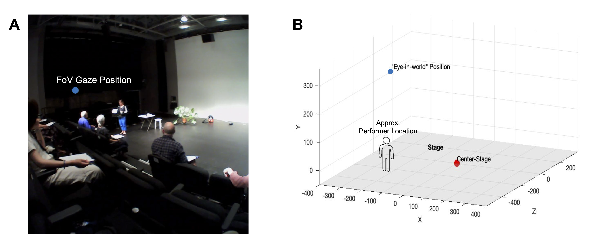
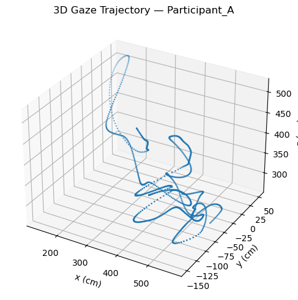

# Gaze Synchrony (IMU + Eye Tracking) — End-to-End Pipeline

*By Jahanara Nares*  
*Adapted from my MSc thesis at Goldsmiths (Computational Cognitive Neuroscience).
In collaboration with Neurolive @ UCL.*

This project demonstrates a full pipeline for analyzing **eye-movement synchrony across participants**:
**raw IMU + gaze → 50 Hz preprocessing → 3D gaze positioning → windowed synchrony** (pairwise and individual→group).

The work is motivated by **cortical time-scale architecture** and temporal integration in perception/social cognition (e.g., Barrett (2017); Kiebel, Daunizeau & Friston (2008); Decety & Jackson (2004)). In the thesis, we compare synchrony over short (5 s) and longer (30 s) windows to probe multi-scale alignment of attention. In this demo, **short (1 s)** and **longer (5 s)** windows are used.

> Full thesis available upon request.


‭ (A) Gaze position (blue dot) relative to audience‬‭ members’ field-of-view, as given by pixel‬
‭ coordinates in Pupil Labs Invisible eye-tracker data. (B) Estimated gaze position (blue dot,‬
‭ -105cm, 360cm, 103cm) relative to center-stage, given by “Eye-in-world” vector as calculated‬
‭ from 3D positioning algorithm (```positioning-3d.py```).

➡️ [View full pipeline notebook here](https://17jnares.github.io/gaze-synchrony-3d-thesis/gaze-synchrony-demo.html)



---

## 🔑 Key Skills Demonstrated
- Time-series engineering: resampling, timestamp alignment (50 Hz), Butterworth filtering
- Sensor fusion: gyroscope integration → heading; gaze normalization → 3D world transform
- Windowed correlation analysis: Fisher-z averaging across axes, pairwise & individual→group
- Reproducible repo structure: `raw/` vs `processed/`, scripts in `src/`, demo notebook

---

## 📁 Project Structure
```
Gaze-synchrony-3d-thesis/
├── README.md
├── requirements.txt
├── src/
│   ├── preprocess.py
│   ├── positioning.py
│   └── synchrony.py
├── notebooks/
│   └── gaze-synchrony-demo.py      # Jupyter notebook
├── data/
│   ├── raw/
│   │   ├── layout/
│   │   │   └── Stage_Layout_Coordinates.csv
│   │   └── demo/
│   │       └── participant_*/
│   │           ├── imu.csv
│   │           ├── gaze.csv
│   │           └── world_timestamps.csv
│   └── processed/
│       └── demo/
│           ├── participant_*/
│           │   ├── imu_50Hz.csv
│           │   ├── gaze_50Hz.csv
│           │   ├── video_timestamps.csv
│           │   └── eye_in_world.csv
│           ├── pairwise_sync/
│           │   ├── 5s/
│           │   │   └── pairwise_group_sync.csv
│           │   └── 30s/
│           │       └── pairwise_group_sync.csv
│           └── indiv_to_group_sync/
│               ├── 5s/
│               │   └── indiv_vs_group_sync.csv
│               └── 30s/
│                   └── indiv_vs_group_sync.csv
└── docs/
       └── demo.png
```
---
## ⚙️ Setup
**Python**: 3.9+  
Install dependencies:

```bash
pip install -r requirements.txt
```
- Data: includes small anonymized demo files in ```data/raw/demo/participant_*/```.
- Layout: includes ```data/raw/layout/Stage_Layout_Coordinates.csv``` with columns:
```Participant, X Distance from center (cm) - pitch axis, Y Distance from center (cm) - yaw axis, Z Distance from center (cm) - roll axis```.

---
## 🚀 Notebook demo
Open notebooks/gaze-synchrony-demo.py in VS Code/Jupyter.
Run top-to-bottom to reproduce plots:
- 3D gaze trajectory (per participant)
- Pairwise group-average & all-pairs curves (1 s / 5 s)
- Individual-to-group synchrony (1 s / 5 s)

---
## ▶️ Running the Full Pipeline (repo root)
1. Preprocess (resample to 50 Hz & align starts)
```bash
python src/preprocess.py
```

2. 3D positioning (gaze → world coordinates; writes eye_in_world.csv)
```bash
python src/positioning-3d.py --export-heading
```

3. Synchrony (pairwise & individual→group; 1 s and 5 s windows)
```bash
python src/synchrony.py
```

---
## 📊 Outputs
```data/processed/demo/participant_*/eye_in_world.csv```
- World-frame gaze (x, y, z in cm) per sample at 50 Hz.

```data/processed/demo/pairwise_sync/{5s,30s}/pairwise_group_sync.csv```
- Columns: ```time_s, PairID_A_B, …, GroupAverage.```
- Pair values are Fisher-z averages of ```(r_x, r_y)```. GroupAverage is the mean of all ```r_x``` and ```r_y``` across pairs (per window).

```data/processed/demo/indiv_to_group_sync/{5s,30s}/indiv_vs_group_sync.csv```
- Columns: ```time_s, PartID_A, PartID_B, … (Individual r_avg vs. group-minus-self avg per window)```.

---
## 🔒 Notes on data & privacy
- Demo files are anonymized and downsized for public sharing.

- The repository mirrors the original pipeline but does not include any confidential or NDA-protected code/data.

---
All rights reserved.
